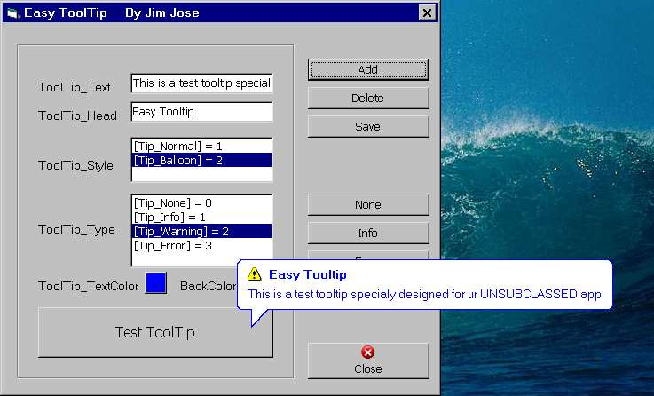



## Custom ToolTip?? Wow\! Thats simple\!\!\!

### Description

[Optimized for simplisity...] This is a simple tooltip generation code, specialy designed for ur UNSUBCLASSED projects. This code does not requires subclassing and can be used for any controls on the form. You have Balloon type and Plain type tooltip. The TextColor and BackColor are customizable. The same code is suited for usercontrols also. May u find it useful Jim Jose :-))
 
### More Info
 

             |
---                |---
**Submitted On**   |2005-07-05 06:42:28
**By**             |[JJJJJJJJ](https://github.com/Planet-Source-Code/PSCIndex/blob/master/ByAuthor/jjjjjjjj.md)
**Level**          |Intermediate
**User Rating**    |5.0 (90 globes from 18 users)
**Compatibility**  |VB 6\.0
**Category**       |[Custom Controls/ Forms/  Menus](https://github.com/Planet-Source-Code/PSCIndex/blob/master/ByCategory/custom-controls-forms-menus__1-4.md)
**World**          |[Visual Basic](https://github.com/Planet-Source-Code/PSCIndex/blob/master/ByWorld/visual-basic.md)
**Archive File**   |[Custom\_Too191062782005\.zip](https://github.com/Planet-Source-Code/jjjjjjjj-custom-tooltip-wow-thats-simple__1-61587/archive/master.zip)

